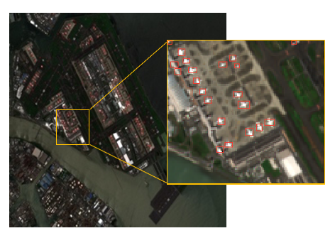

# Airplane-detection

## Introduction

In order to understand the changing trend of the number of airplanes as an index of the airport activity, here applied a method that utilizes convolutional neural networks to effectively detect airplane in Sentinel-2 images. From the detection, we successfully obtained the changing trend of the number of airplanes in important airports around the world since the outbreak of COVID-19, and found different changing trends in different areas that may reflect different reactions to COIVD-19 situation in each country. Paper available open access at: https://igarss2021.com/view_paper.php?PaperNum=1248 

## Dataset Information

In this paper, we use the Rareplanes dataset as the training set. Available Open access at:
https://github.com/aireveries/RarePlanes

The data used to detect the image uses data taken by the Sentinel-2 satellite. Available Open access at: https://github.com/sentinel-hub/sentinelhub-py

## Training steps

1. This article uses VOC format for training.
2. Before training, put the label file in the Annotation under the VOC2007 folder under the VOCdevkit folder.
3. Before training, place the picture files in the JPEGImages under the VOC2007 folder under the VOCdevkit folder.
4. Use the voc2yolo4.py file to generate the corresponding txt before training.
5. Run voc_annotation.py in the root directory again, you need to change the classes to your own classes before running.
6. At this time, the corresponding 2007_train.txt will be generated, and each line corresponds to the position of the picture and the position of the real frame.
7. Run train.py to start training.

## Example images

A sample of the result is provided at in `./sample`

  

